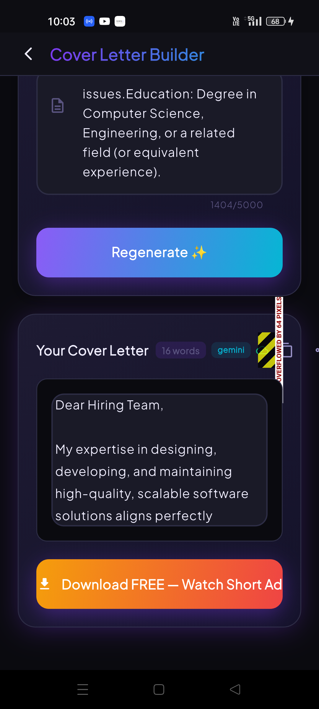

<div align="center">
  
  <h1>Ats.Ai – AI-Powered Resume Builder</h1>
  <p><em>Build, Tailor, Score, and Export ATS-friendly resumes that win interviews.</em></p>

  <p>
    
    
    
    
    
  </p>
</div>

---

<div align="center">
  
</div>

Ats.Ai is a production-ready mobile application built with **Flutter** and **Firebase**, designed to help job seekers bypass Applicant Tracking Systems (ATS). By leveraging Google's **Gemini AI**, the app deeply analyzes resumes against target Job Descriptions (JD) and provides actionable, metric-driven optimization strategies.

## ✨ Core Features

*   **Intelligent ATS Scoring:** Get instant feedback on how well your resume matches a JD. Identifies missing critical keywords and formatting red flags.
*   **Safe AI Auto-Tailoring (JD Matcher):** Tailor your summary and experience to match the exact requirements of a job.
    *   *Safe Preview Flow:* AI changes run in a dry-run sandbox. Users must explicitly review the changes and pick which missing keywords they actually possess before saving.
    *   *Non-Destructive:* The app saves snapshot versions of the original resume before applying any AI overwrites, allowing instant rollbacks.
*   **7 Premium PDF Templates:** Export pixel-perfect, ATS-readable PDFs. Templates include *Classic, Modern, Minimal, Elite, Ivy, Startup,* and *Global*.
*   **Firebase Integration:** Real-time cloud sync, secure Google/Email authentication, and robust cloud storage for user profile photos.
*   **Monetization & Ads:** Fully integrated with AdMob (rewarded ads for AI generation limits) and RevenueCat (Pro subscriptions).

## 🏗️ Architecture & Tech Stack

### Mobile App (Frontend)
*   **Framework:** Flutter (Dart)
*   **State Management:** Riverpod (`flutter_riverpod`)
*   **Routing:** GoRouter
*   **Backend Services (BaaS):** Firebase Auth, Cloud Firestore, Cloud Storage, Crashlytics, Analytics
*   **In-App Purchases:** RevenueCat (`purchases_flutter`)
*   **Monetization:** Google Mobile Ads (`google_mobile_ads`)
*   **PDF Generation:** `pdf` and `printing` packages (using safe `pw.Container` rendering for cross-platform bullet compatibility).

### Backend Server (Optional / Analytics / Quota limits)
*   **Framework:** Node.js + Express
*   **AI Providers:** Gemini SDK & Groq Integration
*   *Note: Most heavy lifting for generative AI is handled securely via the backend or secure edge functions to prevent exposing API keys in the client bundle.*

## 🚀 Getting Started

### Prerequisites
*   [Flutter SDK](https://docs.flutter.dev/get-started/install) (`>=3.11.4`)
*   Firebase CLI installed and authenticated
*   A Firebase project with Firestore, Auth, and Storage enabled
*   Node.js (`>=18`) for the backend

### 1. Flutter Setup
```bash
# Clone the repository
git clone https://github.com/Nishanth619/ats_resume_server.git
cd ats_resume_server

# Install Flutter dependencies
flutter pub get

# Setup Firebase (using FlutterFire CLI)
flutterfire configure --project=your-firebase-project-id
```

### 2. Environment Configuration
Create a `.env` file in the root of the project (do not commit this file):
```env
# Example .env file
GEMINI_API_KEY=your_gemini_key
REVENUECAT_ANDROID_KEY=your_rc_key
ADMOB_ANDROID_BANNER=ca-app-pub-3940256099942544/6300978111
```

### 3. Backend Setup
Navigate to the backend directory, install packages, and set up your production keys:
```bash
cd backend
npm install

# Start the server locally
NODE_ENV=development GEMINI_API_KEY=... npm run dev
```

### 4. Running the App
Run the app using `--dart-define` to inject necessary public runtime variables:
```bash
flutter run --release \
  --dart-define=BACKEND_URL=https://your-backend-url.com \
  --dart-define=REVENUECAT_ANDROID_KEY=your_public_revenuecat_key
```

## 🛡️ Production & Safety Guidelines

*   **Never commit API Keys:** The client `.env` should only contain non-critical public keys (like RevenueCat public identifiers). Secret keys like `GEMINI_API_KEY` belong strictly on the Node.js backend or Firebase Secrets.
*   **Firestore Security Rules:** Ensure `firestore.rules` and `storage.rules` are deployed properly before public launch. Users should only be able to read/write their own document paths (`match /users/{userId}/...`).
*   **ProGuard/R8:** The app includes configured rules for release builds to optimize size and obfuscate code.

## 🤝 Contributing

Contributions, issues, and feature requests are welcome! Feel free to check the issues page.

## 📄 License

This project is licensed under the MIT License.
